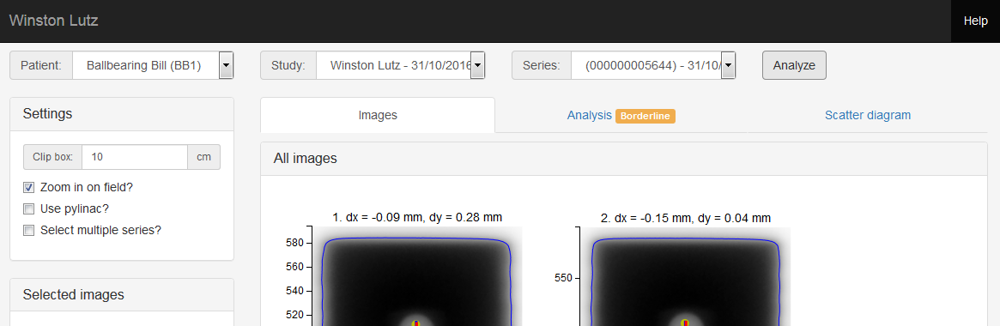

# QAserver

QAserver connects [Pylinac](https://github.com/jrkerns/pylinac) and [Orthanc](https://github.com/jodogne/Orthanc) with a simplistic web interface. It was built to speed up the image analysis process with Pylinac, without having to switch computers or work manually with dicom files. The procedure is easy: acquire the image, send the image from the imaging computer directly to Orthanc, and then analyze it with Pylinac by using QAserver. Since all images are stored in Orthanc, you can re-analyze them anytime you want. You can do the analysis on any computer in your network.

## Compatibility and dependency

It works on Windows 7 and 10. Currently, it is compatible with Pylinac 2.2.7 and Python 3.7. Because of the way QAserver is constructed, it is highly likely that it will not work with newer versions of Pylinac. 

Not all Pylinac's capabilities are implemented. Trajectory logs cannot be analyzed, the calibration module is missing, and there are some missing features in other modules. Basically, this are the modules you can use:

* Winston Lutz
* Starshot
* Picket fence
* Planar imaging
* CT
* Dynalog
* Flatness/Symmetry
* VMAT

With an additional derivative module I call "Fieldsize".

QAserver contains little original code, just enough to connect Pylinac and Orthanc. Some dependencies are included in the distribution of QAserver, other dependencies must be installed separately. Orthanc is not included in the distribution of QAserver.

Here is a list of some of the software used (common packages like scipy, numpy etc. are not listed):

* [Pylinac](https://github.com/jrkerns/pylinac)
* [Bottle](https://bottlepy.org/docs/dev/)
* [httplib2](https://github.com/httplib2/httplib2)
* [prettytable](https://github.com/jazzband/prettytable)
* [Resttoolbox.py](https://github.com/jodogne/OrthancMirror/tree/master/Resources/Samples/Python)
* [Bokeh](https://docs.bokeh.org/en/latest/index.html)
* [mpld3](https://mpld3.github.io/)
* [Bootstrap](https://getbootstrap.com/docs/3.4/)
* [Bootstrap-datepicker](https://bootstrap-datepicker.readthedocs.io/en/latest/)
* [Popper](https://popper.js.org/)
* [math.js](https://mathjs.org/)

## Download

QAserver cannot be installed as a Python package. You must download the zip archive and follow installation instructions given below.

* [Version 1.0](/versions/qaserver1.0.zip)

## Installation and user guide

Installation instructions and the user guide are available at:

* [Version 1.0](https://brjdenis.github.io/qaserver/docs/version1.0/html/) , [PDF](/pdf/qaserver1.0.pdf)

## Bugs and requests

You can contribute to this project with suggestions or bug reports to: brjdenis2000@gmail.com.

I don't really understand how github works, so the best way to reach me is to send me an email.

What is the point of this project? Well, it started as an experiment. I wanted to do the Winston-Lutz test on an Elekta linac a couple of years ago, but didn't have the faintest idea how to do it. I stumbled upon Pylinac and learned a lot from it. So I put all the modules that I use into the web interface... I have too much time and not enough life.