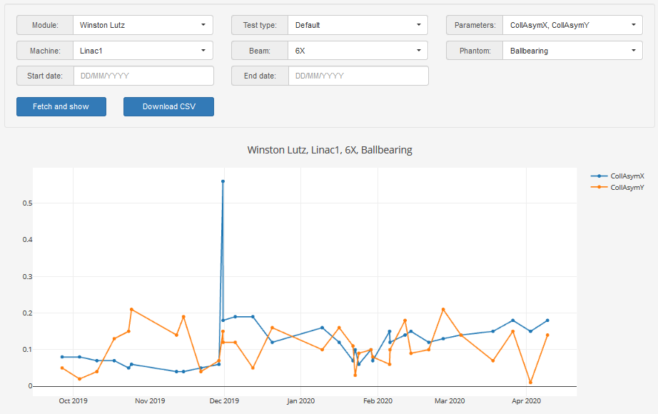

# pyQAserver

Pyqaserver connects [Pylinac](https://github.com/jrkerns/pylinac) and [Orthanc](https://github.com/jodogne/Orthanc) with a simplistic web interface. It was built to speed up the image analysis process with Pylinac, without having to switch computers or work manually with dicom files. The procedure is easy: acquire the image, send the image from the imaging computer directly to Orthanc, and then analyze it with Pylinac by using pyqaserver. Since all images are stored in Orthanc, you can re-analyze them anytime you want. You can do the analysis on any computer in your network.

Pyqaserver also contains a small database where you can store and review your measurements.

## Compatibility and dependency

It works on Windows 7 and 10. It should work on Linux as well. Currently, it is compatible with Pylinac 2.3.2 and Python 3.8. Because of the way pyqaserver is constructed, it is highly likely that it will not work with newer versions of Pylinac.

Not all Pylinac's capabilities are implemented. Trajectory logs cannot be analyzed, the calibration module is missing, and there are some missing features in other modules. Basically, this are the modules you can use:

* Winston Lutz
* Starshot
* Picket fence
* Planar imaging
* CT
* Dynalog
* Flatness/Symmetry
* VMAT

With an additional derivative modules I call "Fieldsize" and "Fieldrot", that can be used to measure radiation to light field match, radiation field size, focal spot position, absolute collimator angle calibration etc. 

Pyqaserver contains little original code, just enough to connect Pylinac and Orthanc. The code is hideously written! But I will improve it. Some dependencies are included in the distribution of pyqaserver, other dependencies must be installed separately. Orthanc is not included in the distribution of pyqaserver.

Here is a list of some of the software used (common packages like scipy, numpy etc. are not listed):

* [Pylinac](https://github.com/jrkerns/pylinac)
* [Bottle](https://bottlepy.org/docs/dev/)
* [httplib2](https://github.com/httplib2/httplib2)
* [prettytable](https://github.com/jazzband/prettytable)
* [Resttoolbox.py](https://github.com/jodogne/OrthancMirror/tree/master/Resources/Samples/Python)
* [Bokeh](https://docs.bokeh.org/en/latest/index.html)
* [mpld3](https://mpld3.github.io/)
* [Bootstrap](https://getbootstrap.com/docs/3.4/)
* [Bootstrap-datepicker](https://bootstrap-datepicker.readthedocs.io/en/latest/)
* [Popper](https://popper.js.org/)
* [math.js](https://mathjs.org/)
* [minimumboundingbox.py](https://bitbucket.org/william_rusnack/minimumboundingbox/src/master/)
* [plotly.js](https://plotly.com/javascript/getting-started/)
* [tabulator.js](http://tabulator.info/)

## Installation and running

Pyqaserver can be installed as a Python package starting with version 2.0.0.  See https://pyqaserver.readthedocs.io/en/latest/

~~~
pip install pyqaserver
~~~

After that you can run it with this:

~~~
pyqaserver IP_ADDRESS:PORT PATH_TO_DATABASE_FOLDER
~~~

For example, if you wish to run it as localhost:

~~~
pyqaserver 127.0.0.1.:8080 PATH_TO_DATABASE_FOLDER
~~~

The PATH_TO_DATABASE_FOLDER must the full absolute path to an empty directory where pyqaserver will install a small database. Anytime you restart the server, point to the same directory.

## Documentation

Documentation is available here:

* [Latest](https://pyqaserver.readthedocs.io/en/latest/)

Older versions:

* [Version 1.0](https://brjdenis.github.io/pyqaserver/docs/version1.0/html/) , [PDF](/pdf/pyqaserver1.0.pdf)

## Bugs and requests

You can contribute to this project with suggestions or bug reports to: brjdenis2000@gmail.com.

The best way to reach me is to send me an email, or you can create a new issue on Github.

What is the point of this project? Well, it started as an experiment. I wanted to do the Winston-Lutz test on an Elekta linac a couple of years ago, but didn't have the faintest idea how to do it. I stumbled upon Pylinac and learned a lot from it. Pylinac is really great because you can see the code, so you can understand how the analysis is performed. I liked this so much that I wanted to make a simple web interface for it. That way I could analyze images while I am still at the linac.

## Some notes on doing tests on Elekta linacs

I put together some personal notes on doing tests on Elekta linacs with Pylinac and QAserver: 

[Notes on doing tests on Elekta linacs](https://brjdenis.github.io/pyqaserver/docs/qaserver-tips/html/)
