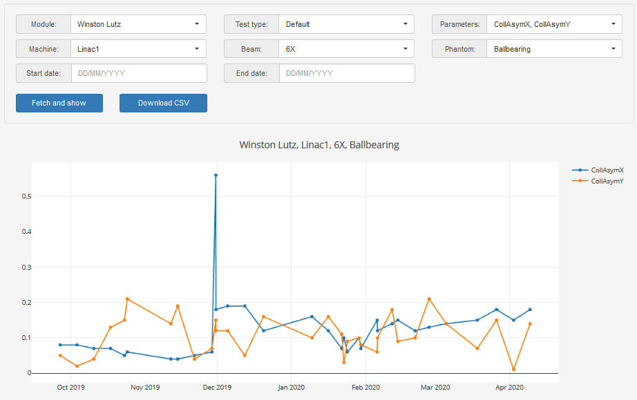

.. index: 

======
About
======
Pyqaserver connects `Pylinac <https://github.com/jrkerns/pylinac>`_ and `Orthanc <https://www.orthanc-server.com/>`_ with a simplistic web interface based on `BottlePy <https://github.com/bottlepy/bottle>`_. It was built to speed up the image analysis process with Pylinac, without having to switch computers or work manually with dicom files. The procedure is easy: acquire the image, send the image from the imaging computer directly to Orthanc, and then analyze it with Pylinac by using pyqaserver. Since all images are stored in Orthanc, you can re-analyze them anytime you want. You can do the analysis on any computer in your network.

Features
=========

	* Analyze any image that Pylinac can read on the fly. Re-analyze it anytime you want.
	* Save the analysis to a dedicated trend database. You can review the trends in tabular or graphical format.
	* Set tolerance levels for your linacs and imagers so that you won't have to think about it later.
	* Automatize the analysis of dynalogs.
	

.. image:: _static/images/overview.png
	:align: center

Not all Pylinac's capabilities are implemented. Trajectory logs cannot be analyzed, the calibration module is missing, and there are some missing features in other modules.

Pyqaserver contains little original code. And the code itself is hideously written. Some dependencies are included in the distribution of pyqaserver, other dependencies must be installed separately. 
	  
A sense of how it works
========================

Orthanc allows to query dicom files (images) via its RESTful interface. The RestToolBox.py module, created by the authors of Orthanc, is used, with some modification, to connect to the Orthanc database, to pick the right images, and then to transfer them to the QA computer. Once the files have been transferred to the computer where pyqaserver is running, they will be parsed to Pylinac for analysis. Pyqaserver will collect the results of the analysis, delete the files locally and send the results back to the web app. And that is more or less it.

Contributions
==============
You can contribute to this project with suggestions or bug reports: brjdenis2000@gmail.com or `pyqaserver <https://github.com/brjdenis/pyqaserver>`_

Warning
========

Pyqaserver may have serious errors. If you see a problem, always run the analysis with pure Pylinac. Do the checks, manually analyze the images so that you understand how things should be done. 
