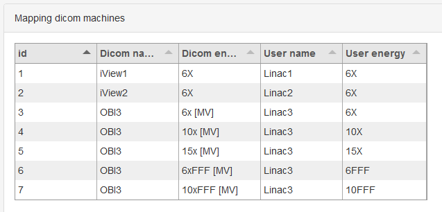

.. index: 

=================
Administration
=================

Except for the dynalog module pyqaserver's administration tasks can be accomplished via the web interface. The administration panel is available only to admin users. The default admin user is admin/admin. 
Admin users can:

* Set Orthanc connection settings.
* Add or remove users.
* Add or remove available machines for each module.
* Set dicom-to-user machine mapping.
* Define tolerance levels.
* Set reference images for the planar imaging and catphan modules.
* Check if dynalog analysis is currently running and start it if needed.

.. note::
	Words and numbers that you enter in the input fields are not validated before storing. Try to stick to alphanumeric ASCI symbols. Avoid white spaces when defining machine names. If necessary, use _ instead of white spaces.

How to edit administration settings?
====================================
Each section has forms with tables that show what data is already stored in the database. Forms have an Add button and a Remove button. When you click Add, data from input fields or check-boxes will be sent to the server for storing. If something goes wrong, you will get an error message. If you wish to remove a row, input the ID of that row and click Remove. Rows with identical data are not allowed. If you wish to change a row, delete it first, and then add it back with different values.

Row ids are not necessary sequential, but they are unique.

General settings
=================

**Edit user list**

	An admin user is always present and cannot be deleted unless another user with admin privileges exists. In general, the user group exist only to give an option of writing a signature when storing measurements.

	Passwords are hashed before they are stored.

	**Username**
		Username for logging in.
	**Password**
		Password for logging in.
	**Display name**
		The name of the user. Measurement will be signed with this name at storing.

**Edit orthanc connection**

	Type in the IP address and port of the computer where Orthanc is running. Username and password are also necessary. Get the data from Orthanc configuration.

**Edit institution name**

	Type in the name of your institution. This will be printed on Pylinac's pdf reports. 

Module settings
================

Define tolerances and available machines. Here is what you must do.

1. For each machine and beam choose a nice unique name. This will be visible throughout pyqaserver. If, for example, you have three linacs, you can name them Linac1, Linac2 and Linac3. Each can than have a list of energies.
2. Define machine mapping. This will map dicom names to your previously chosen ones.
3. Go through each module settings and fill out all the machine/unit tables.
4. Define tolerances.
5. For planar imaging and catphan modules define reference images.

Machine mapping
----------------
All modules except for Planar imaging and Catphan use machine mapping to guess machine/beam from dicom tags. Here you define a bijective correspondence between dicom tags and your chosen machine names. Choose wisely. Here is an example for three linacs. The first two are Elektas and the third is a Varian linac. Note that for the Elekta linacs only one line exists per linac. That is because Elekta linacs do not write beam energy to dicom tags, therefore only machine mapping will work.

How to get the dicom names? Send one image from the linac to Orthanc. Select the image in any pyqaserver module. Read two tags: **Station** and **Image description**. Station is the "Dicom name" of the machine. And the first string before the comma is "Dicom energy" of the beam.

.. image:: _static/images/admin_mapping.png
	:align: center

For the Winston-Lutz module the settings would look something like this:

.. image:: _static/images/admin_wl.png
	:align: center

Winston-Lutz
-------------

	**Pass tolerance**
		The radius of the red circle in the scatter diagram. Radius above this value will have a failed status. Unit: mm.
	**Action tolerance**
		The radius of the green circle in the scatter diagram. Radius bellow this value will have a passed status. Unit: mm.
	**Apply to coll asymmetry?**
		Choose whether the tolerance level will be applied to each analyzed image or to the section "Collimator asymmetry".
	**Coll. asym. tol.**
		The tolerance for the average collimator asymmetry. Unit: mm.
	**Beam dev. tol.**
		The tolerance for the lateral beam deviation. Unit: mm.
	**Couch dist. tol.**
		The tolerance for the deviation of the couch axis of rotation from the MV isocenter. Unit: MV.

Starshot
--------
	
	**Tolerance**
		The tolerance for circle diameter. Unit: mm.
	**Generate PDF report?**
		Choose whether to generate a pdf report.

Picket Fence
------------

	**Action tolerance**
		The action tolerance for the test. See Picket fence documentation. Unit: mm.
	**Tolerance**
		The tolerance for the test. See Picket fence documentation. Unit: mm.
	**Generate PDF report?***
		Choose whether to generate a pdf report.

VMAT
------

	**Tolerance**
		The tolerance for the test. See Pylinac for further info. Unit: mm.
	**Generate PDF report?**
		Choose whether to generate a pdf report.

Field size
-----------
The tolerances apply to field width. Three field widths can be defined: small, medium and large. The server will guess which of the three is used from the measured width.

	**Nominal**
		The nominal field width. If you are testing 10 cm x 10 cm, use for nominal width a value of 10. Unit: cm.
	**Expected mlc**
		The expected field width in the MLC direction. This may not be equal to the nominal width. Unit: cm.
	**Expected jaw**
		The expected field width in the jaw direction. This may not be equal to the nominal width. Unit: cm.
	**Tolerance mlc**
		The tolerance for the difference between measured and expected field width in the MLC direction. Unit: cm.
	**Tolerance jaw**
		The tolerance for the difference between measured and expected field width in the jaw direction. Unit: cm.
	**Tolerance isocenter**
		The tolerance for the CAX deviation from the mechanical center. Unit: cm.

Field rotation
---------------

	**Tolerance coll. abs.**
		Tolerance for the collimator angle error. Unit: degree.
	**Tolerance coll. rel.**
		Tolerance for the collimator increment error. Unit: degree.
	**Tolerance couch. rel.**
		Tolerance for the couch increment error. Unit: degree.

Flatness/Symmetry
-------------------
	
	**Tolerance flatness**
		Tolerance for the flattness of the beam. Unit: percent.
	**Tolerance symmetry**
		Tolerance for the symmetry of the beam. Unit: percent.
	**Generate PDF report?**
		Choose whether to generate a pdf report.

	If you are using the Varian analysis definition, the tolerance is applied like so: 100 % +- tolerance.

Planar Imaging
---------------

	**High threshold**
		High-frequency rMTF threshold. 
	**Low threshold**
		Low-frequency contrast threshold. 
	**Orthanc instance**
		A reference image can be saved by inputing the Orthanc instance. Acquire a nice image that you would like to have as a reference for future comparison. Open the image in Orthanc and get its uuid from the http address found in the address bar of the browser.

		.. image:: _static/images/admin_planar_imaging.png
			:align: center

Catphan
--------

	**HU tolerance**
		The tolerance for Hounsfield units (ctp404) and the uniformity module (ctp486). Unit: HU.
	**LCV tolerance**
		The threshold for the low contrast visibility. Unit: LCV.
	**Scaling tolerance**
		The tolerance for geometric scaling. Unit: mm.
	**Thickness tol.**
		The tolerance for slice thickness. Unit: mm.
	**Low contrast tol.**
		The number of low contrast bubbles (ctp515) that must be "seen" in order for the test to pass. 
	**CNR threshold**
		The threshold for the CNR constant of the low contrast bubble (ctp515) above which the bubbles are considered as "seen". Unit: CNR constant.
	**MTF tolerance**
		The tolerance for the difference between the reference and current 50 % rMTF. Unit: percent.
	**Uniformity tol.**
		The tolerance for the uniformity index. Unit: percent.
	**Orthanc series**
		A reference scan can be saved by inputing the Orthanc series uuid. Acquire a nice scan that you would like to have as a reference for future comparison. Open the series in Orthanc and get its uuid from the http address found in the address bar of the browser. You may have to wait a while for the server to store the scan.

		.. image:: _static/images/admin_catphan.png
			:align: center	

Dynalog - Check/Start analysis
--------------------------------
The Dynalog module cannot be administered through the web interface. See the Dynalog configuration section to set up the database and dynalog collection.

**Check/Start analysis**
	Here you can check if the analysis is currently running. And start it if needed. Only one runnin instance is possible. It is best to run the analysis automatically during the evening. See the Dynalog configuration section.

Dynalog configuration
----------------------

In the directory that you have chosen to keep your databases, there is a dedicated folder called "dynalog_database". It contains a configuration file "dynalog_config.ini" and a python script "dynalog_send_post_request.py" for starting the analysis automatically.

How the analysis works? Your MLC controller (computer) should be configured to copy created dynalogs to a dedicated network folder. We call this folder "repository". Each linac should have its own repository. In the evening a scheduling app like the Windows Task Scheduler will run the *dynalog_send_post_request.py* script. This script sends a http post request to the pyqaserver that will start the analysis of all the dynalogs contained in the configured repositories. 

During analysis each dynalog will be processed, basic results will be stored in the sql database, and the dynalog itself will be stored to a zip archive. The name of the archive is normally "YYYY_MM.zip" and is found in the "dynalog_database/ARCHIVE" directory. Each month a new archive will be created, so you do not have too large files. Records in the sql database and dynalogs in the zip archive are linked. 

.. warning::
	Do not edit the zip archive or the sql database manually unless you really have to. Also, do not run the analysis at midnight.

If there was an error while analyzing dynalogs, the problematic dynalog will be copied to the *dynalogs_with_errors* folder.

It is possible for the pyqaserver to send a summary of the analysis via email. Only use this if you are sure you want to receive this data every day.

When you use the web interface to analyze one particular record, the corresponding dynalog is extracted from the zip archive and analyzed again with settings that you can define in the interface.

The *dynalog_config.ini* must be configured before pyqaserver is started. Here are the settings.

	**TOLERANCE_DTA**
		The (gamma) distance-to-agreement tolerance for automatic analysis. Unit: mm.

	**TOLERANCE_DD**
		The (gamma) dose difference tolerance for automatic analysis. Unit: percent.

	**THRESHOLD**
		The dose threshold for gamma analysis. Unit: percent.

	**RESOLUTION**
		Resolution for gamma calculation. Unit: mm.
	
	**EXCLUDE_BEAM_OFF**
		See Pylinac for further information. Values: True or False.

	**DYNALOG_REPOSITORIES**
		A list of paths where dynalogs are located (the "repositories"). Normally each linac (or MLC controller) stores dynalogs in a particular network folder. You can ask your engineers to set this up. Enter the full path of the folder. For many repositories make a list:
		
			DYNALOG_REPOSITORIES = \\network_path1\\linac1\\dynalogs, \\network_path2\\linac2\\dynalogs

		Of course the paths need not be network paths. If you wish to experiment, you can just use local folders.

	**REPOSITORIES_LABELS**
		A list of names (labels) for each entry to DYNALOG_REPOSITORIES. Keep the same order as DYNALOG_REPOSITORIES. These labels should match your linac name, like Linac1, Linac2 etc.

	**SEND_EMAIL**
		If set to True, pyqaserver will send a short summary of the results via email. Values: True or False.

		.. warning::
			Note that patient ID will be visible.

	**SMTP_SERVER**
		The SMTP server address. For example: smtp.gmail.com.

	**SMTP_PORT**
		The SMTP port. For example: 587.

	**SEND_FROM_USER**
		Your email account for sending messages. For example: firstname.lastname@gmail.com.
		
	**SEND_FROM_PASSWORD**
		The password that you are using to access the account. It is not encrypted.

	**SEND_TO**
		A list of receivers. For example: person1@gmail.com, person2@gmail.com, etc. Use a comma to separate addresses.

Dynalogs - Setting up scheduled analysis
--------------------------------------------------
Open "dynalog_send_post_request.py" and edit the *http* variable

``http://localhost/dynalog_start_batch_analysis``

Change the address to that where pyqaserver is running. For example,

``http://192.168.14.255:80/dynalog_start_batch_analysis``

Do not forget the port, even if it is 80.

Open Windows Task Scheduler and create "basic task". Choose "Start a program". 
For *Program/Script* set the path to python.exe. For *Arguments* set "dynalog_send_post_request.py". And for *Start in* set the path to the folder where "dynalog_send_post_request.py" is located.

Keeping it clean
==================

From time to time check the folders for remaining files. In particular: temp_dcm_archive, temp_dynalog_folder, temp_nondicom_archive and temp_pdf_reports. The last one may be full of old pdf reports.

