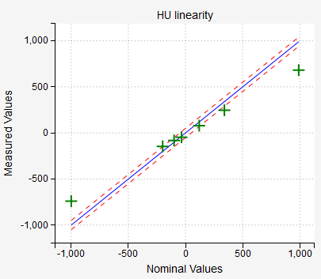
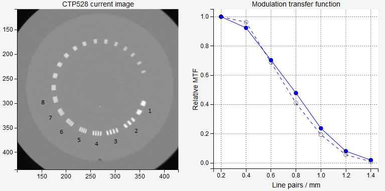
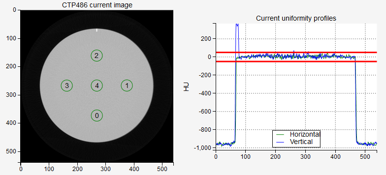
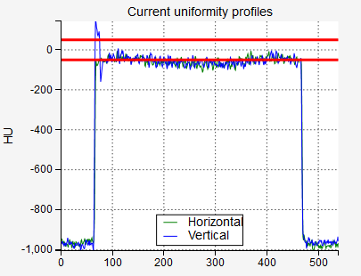

.. index: 

===============
Catphan module
===============

Four catphan models can be used:

* Capthan 503
* Catphan 504
* Catphan 600
* Catphan 604

When scanning the phantom follow `Pylinac's <https://pylinac.readthedocs.io/en/stable/cbct_docs.html>`_ guidelines. Scan the whole phantom by placing the center of the phantom in the center of the image. Make sure it is well positioned, that is, aligned to the room lasers or other systems.

.. note::
   The analysis of one single CT/CBCT scan with an axial length of 26 cm (approx. 130 slices with 2 mm slice thickness), and a resolution  of 512x512 will take about 20-30 seconds to complete on a regular computer. The analysis of both the reference scan and the current scan will take longer. If your computer is behind a server that has too short timeout for http requests, you will not get the analysis.

Options
===============

**Select phantom**
	Select the phantom that you wish to analyze. Pylinac cannot determine the phantom model from the image, you must tell Pylinac which model you are using.

**Select machine/beam**
	If you are using reference images, you can select the appropriate reference image for your imager. See the section "administration" for more details about how to set the reference images.

**Analyze reference?**
	Choose whether to analyze the reference image.

**Show HU Delta?**
	If you check this box, the HU plot will show differences, and not absolute values of HU.

Interpreting results
==============================
Each phantom model contains specific regions for studying different aspects of image quality. Models 504, 600 and 604 contain modules CTP404, CTP486, CTP528 and CTP515. Model 503 contains modules CTP404, CTP486 and CTP 528.

.. note::
   The results of the analysis are gathered in tabs. Each module has its own tab. Next to the name of the module a **pass**/**fail** statement is given. A module gives general passing result if each submodule has passed the test. For example, the CTP404 module gives a passing result if the HU, LCV, slice thickness etc. have passed.

If no tolerance levels are defined in Administration, default values will be used:

+-------------------+------+
| HU tolerance      | 100  |
+-------------------+------+
| LCV tolerance     | 2    |
+-------------------+------+
| Scaling tolerance | 0.5  |
+-------------------+------+
| Thickness tol.    | 0.25 |
+-------------------+------+
| Low contrast tol. | 1    |
+-------------------+------+
| CNR threshold     | 10   |
+-------------------+------+
| MTF tolerance     | 10   |
+-------------------+------+
| Uniformity tol.   | 3    |
+-------------------+------+

CTP404
---------------

This module is used to test the low-frequency contrast, HU units and geometry of the image. It is the reference module for all models.

.. image:: _static/images/catphan2.png
	:align: center

.. note::
   Hover over the phantom image to reveal detected ROIs. 

If a particular material has passed the HU test, it will be colored green, otherwise red. Blue circles are background ROIs. 

A ROI has passed the test if the difference between nominal and current HU is less than **HU tolerance**. 

.. note::
   CBCT scans normally give a failed status for the HU units.

Low contrast visibility is calculated like this:

.. math::
   \mathrm{LCV}= 2\times\left|\frac{\textrm{median HU}\,(\textrm{LDPE})-\textrm{median HU}\,(\textrm{Poly})}{\textrm{std HU}\,(\textrm{LDPE})+\textrm{std HU}\,(\textrm{Poly})}\right|

LCV will have a passing status if it is larger than the **LCV tolerance**.

Each HU disc is evaluated for CNR. It is calculated like this:

.. math::
   \textrm{CNR}\,(\mathrm{HU}_i) = 2\times\left|\frac{\mathrm{median}\,(\mathrm{HU}_i)-\mathrm{median}\,(B)}{\mathrm{std}\,(\mathrm{HU}_i)+\mathrm{std}\,(B)}\right|

Where background ROIs should be averaged to give one value for the HU and standard deviation.

Slice thickness will pass the test if the difference between the nominal value and the measured value is within **Thickness tol.** If your image is very noisy or of low quality in general, it may happen that Pylinac will not calculate slice thickness properly.

Geometry scaling will pass the test if all the lines (marked as Lines 1, 2, 3, 4) have a length of 50 mm plus-minus **Scaling tolerance**.

Phantom roll measures the axial rotation of the image. It has no tolerance, but you can use it to see if the image is axially well orientated. To do that, you must set the phantom accurately to well adjusted room lasers. Or use the spirit level. If you detect a phantom roll of, say, 1 degree, this means that your image is rotated. Which is bad. 

CTP528
---------------
This module is used to test the high-frequency contrast of the image. Eight line-pair regions are analyzed. 

The relative transfer modulation function is calculated similarly to that of the Planar imaging module. Within the circular band containing the line-pair region, circular profiles are drawn and averaged for each region. From the profiles min and max pixel values are calculated. For region  2, say, there are three peaks and two valleys, and hence three max values will be averaged into one, and two min values will be averaged into one. At the end, the rMTF for this region will be:

.. math::
   \textrm{rMTF}\,(H_i) = \left.\frac{\mathrm{max}\,(H_i)-\mathrm{min}\,(H_i)}{\mathrm{max}\,(H_i)+\mathrm{min}\,(H_i)} \middle/ \frac{\mathrm{max}\,(H_0)-\mathrm{min}\,(H_0)}{\mathrm{max}\,(H_0)+\mathrm{min}\,(H_0)}\right.

Where min and max are averaged min and max values.

If the difference between the reference and current 50% rMTF  is not greater than **MTF tolerance**, the test will pass. A better way would be to have an absolute tolerance for rMTF, but this is for the next version of pyqaserver.

CTP486
---------------

This module is used to test the uniformity of the image.

The uniformity index is calculated like so:

.. math::
   \textrm{uniformity index} = 100\times\,\max\limits_{i=0,1,2,3}\left\{\frac{\textrm{median HU}\,(\mathrm{ROI}_i) - \textrm{median HU}\,(\mathrm{center})}{\textrm{median HU}\,(\mathrm{center})+1000}\right\}
   

In the formula, the maximum value is sought within a list of absolute values, however, the sign is preserved in the final presentation.

The uniformity index will pass if the value is within the **UNIFORMITYIDX** tolerance.

Besides the uniformity index the absolute HU values are tested as well. They should be close to 0. The absolute values will pass if they are within the **HU** tolerance. 

.. note::
   For CBCT scans the uniformity test may fail for large FOV or in combination with some types of filters. This is not a reason to be alarmed, it is normal. Neither HUs or uniformity profiles are of great relevance in CBCT scans.

The image below gives an example of a perfectly normal CBCT scan with passing Uniformity index, but a failed CTP486 test because the HU values are too low. 

CTP515
---------------

This module is used to study low-contrast visibility.  Pylinac samples the image with several ROIs. The contrast constant is calculated and plotted as a function of circle diameter. Contrast constant is the product of contrast and the circle diameter.

The test will pass if Pylinac detects at least a certain number of ROIs that are defined with **LOWCONTRAST** tolerance (number of ROIs that must be seen). In order for a ROI to be seen, the CNR constant must be greater than the **CNR**  threshold. CNR constant is the product of CNR and circle diameter.

.. image:: _static/images/catphan6.png
	:align: center

The CNR is defined as

.. math::
   \textrm{CNR}\,(L_i) = \frac{\mathrm{median}\,(L_i)-\mathrm{median}\,(B_i)}{\mathrm{std}\,(L_i)}

Background Bi are the average of inner and outer background ROIs corresponding to Li.

.. note:: 
	Pylinac may average slices to improve CNR. Keep this in mind when comparing results with manual calculations on a single slice.

