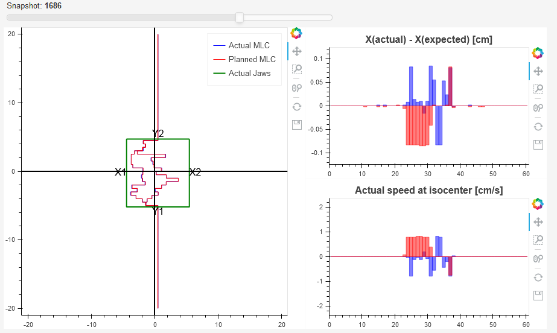

.. index: 

===============
Dynalog module
===============

This module is used to analyze dynalogs. It is meant to be used for everyday tracking of MLC dynamics during treatment. Please read the configuration instruction carefully in order to set up the dynalog module.

When pyqaserver is started, it will either connect to the dynalog database or create one. The database cannot be filled with data manually. A special post request must be sent to pyqaserver to read dynalogs from the repository, and store them into the database. All this must be set up beforehand.

Options
===============

	* **Filter by date 1** 
		If only Date 1 is defined, then all IDs of patients that were treated on that day will be collected. 
	* **Filter by date 2**
		Only works with those searches (see below) that require a time interval.
	* **Records** 
		Selecting date 1 displays all the records that belong to that particular patient on that date.
	* **Select field for analysis**
		Here you can select the field for analysis. Beam ids are ordered in the same way as in the records display.
	* **Select MLC**
		You can choose between normal 120 MLC or HD 120 MLC. 
	* **Gamma analysis settings**
		Here you can define the gamma analysis parameters. 
	* **Analyze**
		By clicking this button, pyqaserver will extract the selected dynalog from the zip archive and re-analyze it with new gamma settings.

Other options
===============

	* **Get all patients!**
		If you click this button, the full list of patients that are in the database will be displayed.
	* **Filter patients - Select folder**
		Select the linac (repository folder) to filter the patient list. Click Go!, and only these patients will be listed.
	* **Filter patients - Filter patient list**
		Type in the id of the patient, and click Go!. Only records for this patient will be fetched. At the same time the "select folder" filter will be applied.
	* **Last upload**
		A quick review of last uploaded and analyzed dynalogs. "Select folder" filter can be used to show recent uploads for a certain linac.
	* **Between dates**
		Similar to "Last upload", except that analysis results are displayed for those dynalogs that were uploaded between the two defined dates ("Date 1" and "Date 2"). "Select folder" filter can be used to show uploads for a certain linac only.
	* **For selected patient**
		Pick a patient from the patient list. Clicking this button will show some results for all treatment fractions.
	* **Get upload dates**
		Get dates for all upload events.
	* **MAX DIFF2 [cm]**
		This will collect all the records within the defined date interval that had the MAX DIFF2 greater than the value you type in. "Select folder" filter can be used to show uploads for a certain linac only.
	* **Histograms between dates**
		Once the date interval is defined (here the interval can actually be empty, ie. all records will be included, or only one side of the interval can be defined), you can click this button to get the distribution of errors across all records. Each bar represents the number of dynalogs that had the error within the bin.
	* **Histogram - probability density?**
		If this is checked, the histogram will be normalized so that the integral is 1. Red bars, if they exist, are the outliers, that is, all dynalogs that had errors greater than the limit are counted here. Normally, this limit is 0.5 cm.
	* **Histogram - logarithmic scale?**
		If this is checked, histograms will be displayed in logarithmic scale.
	
	
How to get data?
==============================

1. I want to get all patients/records for a particular date

	Click **Filter by date 1** and choose the date. **Patient** dropdown will be populated. In the **Record** dropdown you can then select the record you want.

2. I want to get all the patients for a particular date and a particular folder (ie. machine)

	In the **select folder** dropdown choose the appropriate folder and repeat 1.

3. I want to get all the records for a particular patient

	Search the patient with the **Filter patient list**. You can filter the results with **Filter patients by folder**.

4. I want to get all the patients from a particular folder (ie. machine)

	Clear the **Filter patient list**, select the appropriate **Filter patients by folder** and click Go!

5. How to find out what records have been saved last?

	Click the **Last upload** button. You can filter the records by machine as well.

6. How to get a summary of all the records for a particular date or between dates?

	Select dates 1 and 2, and then click the **Between dates** button. You can filter the patients by machine as well.

7. How to analyze one particular dynalog?

	Choose the record and select the desired field (**Select field for analysis**). Select the appropriate MLC type (**Select MLC**) and then click **Analyze**.

Record data
===============

**Field**
	The number of the field. If dynalog does not contain a record of the field id, the value will be "NA".

**Gantry**
	Gantry angle or arc starting angle.

**Time**
	Time of treatment.

**Snaps**
	Number of snapshots. Snapshots are 50 ms apart.

**Holds**
	The number of times that the MLC controller demanded beam hold.

**Max RMS [mm]**
	Maximum RMS over all snapshots and all leaves.

**Max RMS2 [mm]**
	Similar to MAX RMS, except that only snapshots when beam was ON and there were no holdoffs are included in the calculation.

**Max DIFF [mm]**
	Maximum difference between planned and measured leaf positions, calculated for all leaves and all snapshots.

**Max DIFF2 [mm]**
	Similar to Max DIFF2, except that only those snapshots are included when beam was ON and there were no beam holdoffs. This value should always be reasonable (2 mm for example), otherwise you have a big problem!

**RMS avg [mm]**
	Average RMS for moving leaves only (when beam was ON and there were no holdoffs). Leaf is moving if the standard deviation of its position over all snapshots is lower than 0.1 mm.

**gamma avg**
	Average gamma.

**gamma<1 [%]**
	Percentage of points that have gamma smaller than 1.

**dd/dta/thresh/res**
	Settings used for gamma calculation: dose difference, distance to agreement, threshold, resolution. See administration.

**Folder**
	Name or label of the folder from where dynalogs were taken. Normally this would be the name of your linac.

Analysis
===============

Pyqaserver returns Pylinac's analysis with some additional info.

MLC
....
Here you can observe planned and actual MLC movements. If you don't see the animation, then there is a problem with your installation of Bokeh. Click on the slider and then use arrow keys (left-right) to move the slider with small increments.

The speed of the leaves is calculated as the first time difference of leaf position. It is severely prone to noise. In future release it will be calculated more robustly.

Red bars correspond to bank A and blue bars correspond to bank B.

Beam status has two signals: CONT/STOP and ON/OFF. The first one is the beam hold off, the second one is beam on or beam off.

Fluence
........
Actual and planned fluence maps are presented. Besides the gamma map a dose difference map is also shown. Gamma and dose difference histograms may show red bars. Those red bars collect all the outliers: greater than 10 % dose difference or gamma greater than 1.

.. image:: _static/images/dynalog2.png
	:align: center

Error histogram
...............
Four histograms are shown: RMS and RMS2, MAX DIFF and MAX DIFF2.

.. image:: _static/images/dynalog3.png
	:align: center

Dose rate
..........

.. image:: _static/images/dynalog4.png
	:align: center

The first graph shows how the beam status is changing over time and how the meterset weight is adding up. 

The second plot is the gantry speed. Gantry speed is not calculated with first-order differences. Instead, gantry angle as a function of time (snapshot) is filtered with the savgol filter using every other point out of the whole snapshot collection. Then the ordinary first order difference is calculated using every third point of the filtered function. This plot is shown in dark blue color. Underneath you will see a faint blue plot, that is the first-order difference of gantry position. It should be extremely noisy.

The dose rate graph is calculated similarly to gantry speed. 

Histograms between dates
..............................
Here is an example of a distribution of MAX DIFF2 values over a period of one month for VMAT/Arc plans. One can see that most dynalogs had MAX DIFF2 smaller than 0.3 cm, one dynalog was recorded with a value between 0.3 and 0.32 cm, and more than 10 dynalogs had errors greater than 0.5 cm. The latter is important, it may show that your MLC system has problems with sticking/stalling leaves. In this case, review the dynalogs and look for treatment interruptions, ie. static leaves.

.. image:: _static/images/dynalog_histograms.png
	:align: center

Here is the same distribution for IMRT plans with few control points, and a tolerance for leaf positioning of 2 mm. You can see how the MAX DIFF2 histogram cuts off at 0.2 cm, but the MAX DIFF has a wider distribution of errors. This is perfectly normal. The first histogram only count errors when beam was actually ON and no HOLD OFF was demanded, while the second histogram counts all the errors over all snapshots. This means that the linac is interrupting the beam to have the leaf position within the 0.2 cm tolerance, but while the beam is off the difference between actual and planned leaf positions can be larger.

.. image:: _static/images/dynalog_histograms2.png
	:align: center
