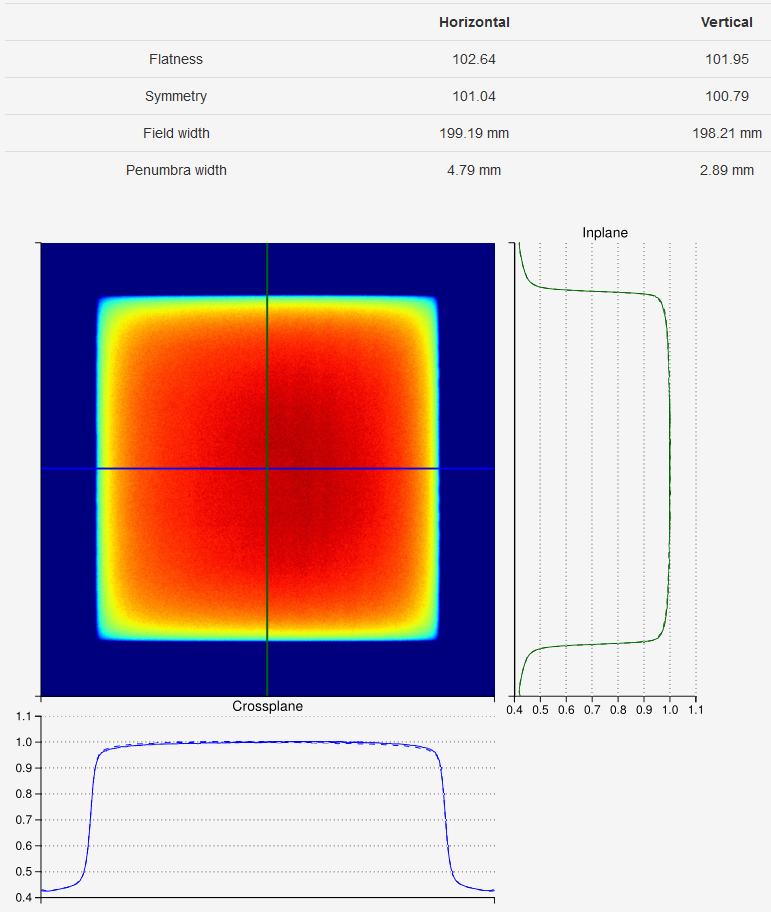

.. index: 

==========================
Flatness/Symmetry module
==========================

.. warning::

   Flatness and symmetry measured with the portal imaging device are not the same as that measured in the water tank. Be sure you understand the results of this module.

Settings
==========================

**Analysis definition:**
	Pick the definition that suits you. See Pylinac for more info. Only one definition can be used for both symmetry and flatness.

	**Varian**-type definitions are:

	.. math::

		\mathrm{symmetry}&= 100\times \max_{x}\left|\frac{D(x)-D(d-x)}{D_\mathrm{CAX}}\right|\\
		\mathrm{flatness}&= 100\times \frac{D_\mathrm{max}-D_\mathrm{min}}{D_\mathrm{max}+D_\mathrm{min}}

	**Elekta**-type definitions are:

	.. math::
		\mathrm{symmetry}&= 100\times \max_{x}\left[\max\left\{\left|\frac{D(x)}{D(d-x)}\right|, \left|\frac{D(d-x)}{D(x)}\right|\right\}\right]\\
		\mathrm{flatness}&= 100\times \frac{D_\mathrm{max}}{D_\mathrm{min}}

	Where *x* runs from 0 on the left side of the profile to *d* on the right side of the profile. *d* is the 80 % FWHM portion of the full profile. :math:`D_\mathrm{max}`, :math:`D_\mathrm{min}` and :math:`D_\mathrm{CAX}` are the maximum, minimum and central profile values within the 80 % FWHM portion of the field.

**Center:**
	Here you can set the point where profiles will be extracted from the image. This point only defines the horizontal and vertical lines for the profiles, it does not define the center of the profiles.
	
	If set to Automatic, Pylinac will do it on its own. If set to Manual, you can enter coordinates of the pixel. If set to CAX, a special function will try to find the center of the field. CAX method may not work well on non-flattened profiles.
	
	If you wish to manually set the origin, then start with some guess, then on the plotted image use the mouse cursor to finely set the final point and enter it into the text box. Then re-analyze.

**Invert image:**
	Check this if you want to invert the image.

Results
==========================

