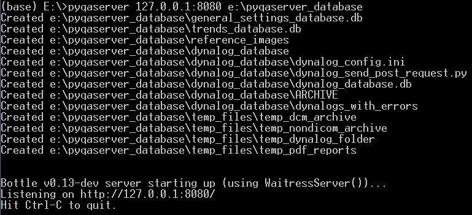
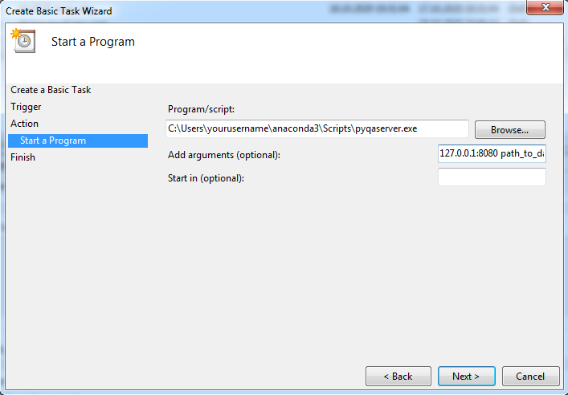
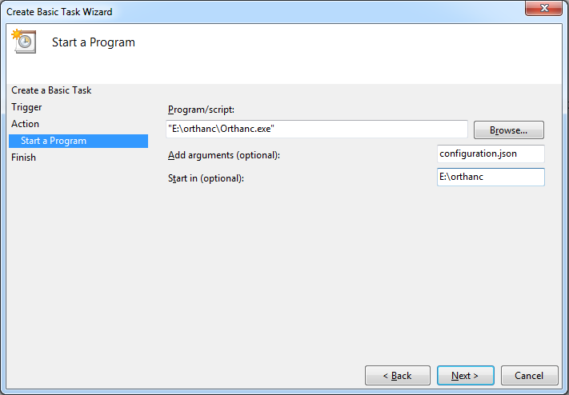

.. index: 

Installation and running
==========================
Pyqaserver and dependencies can be installed via pip. Orthanc must be downloaded and installed separately.

Pyqaserver should be run on a computer that is connected to your hospital local network. There are no special requirements, a normal desktop computer should be sufficient. Have at least 2 GB or RAM and a decent CPU. It works on Windows, it should work on Linux as well.

	.. warning::
		Do not make pyqaserver available to the public domain. Pyqaserver does not implement ANY safety features, so by making pyqaserver public you are at risk of exposing your data. 

Dependencies
--------------
Pyqaserver is sensitive to the version of dependencies. For pyqaserver 2.0.0 these must be respected:

.. list-table::
	:widths: 50 50
	:header-rows: 1
	:align: center

	* - Software
	  - Version
	* - Python
	  - >= 3.7
	* - Pylinac
	  - 2.3.2
	* - bokeh
	  - 2.2.1
	* - httplib2
	  - 0.18.1
	* - matplotlib
	  - 3.3.1

Certain dependencies were adjusted to work with pyqaserver. These are packaged with pyqaserver. They include:

	- Pylinac's flatness/symmetry module (version 2.3.1)
	- A modified version of pylinac's picket fence module
	- Pylinac's planar imaging module (version 2.3.2) with some modifications
	- `mpld3 <https://github.com/mpld3/mpld3>`_ (version 0.3) with some modifications
	- `minimumboundingbox.py <https://github.com/BebeSparkelSparkel/MinimumBoundingBox>`_ module
	- Development version of `bottlepy <https://github.com/bottlepy/bottle>`_ (version 0.3)

Installing pyqaserver
----------------------

If you don't have a Python environment, download the latest `Anaconda <https://www.anaconda.com/products/individual>`_. The version used in this user manual is Anaconda3 2020.07.
When you install Anaconda, choose to add Anaconda to your PATH environment variable.

Open Anaconda prompt and use pip to install pyqaserver:

``pip install pyqaserver``

All should go well if you installed Anaconda afresh.

Running pyqaserver
-------------------

Prepare a special directory on your local hard drive where the whole pyqaserver database will be stationed. The directory should be empty, pyqaserver will populate it with data.

Pyqaserver accepts two arguments:
	- IP addres + PORT
	- path to database directory

To start it as localhost:

``pyqaserver 127.0.0.1:8080 path_to_database_folder``

Open a web browser and go to the site that is being served: http://127.0.0.1:8080. The default username/password is: admin/admin.

You can stop the server by pressing CTRL+C. If you restart it again, you will notice that the files inside the database directory will not change. The server will use existing database.

Port definition is required, even if it is port 80. If you want to make the site available to other computers in the network, instead of localhost use your computer's IP address. For PORT use 80 so that people won't have to type in the port in the web browser, only the IP address.

Setting up Orthanc
-------------------
Download Orthanc from their `webpage <https://www.orthanc-server.com/>`_, and install it. You can even install it on a different computer.

The folder should contain a special JSON configuration file. If the file is not already present, you can generate it by running this in Windows Command Prompt (after opening CMD go to the Orthanc folder):

``orthanc --config=Configuration.json``

Open the file in a text editor like Notepad++ (be careful, sometimes there is a problem with the encoding, and changing the file will make it unreadable by Orthanc). 

First, set the HTTP port for REST services and GUI.

``"HttpServerEnabled" : true``

``"HttpPort" : 8042``

Next, set the dicom port to either 4242 or 104. Port 104 is usually used for dicom transport, but 4242 will also work. This port is where imaging workstations have to send images to, so use this port to set up your imaging computers or treatment information systems.

``"DicomServerEnabled" : true``

``"DicomPort" : 104``

Change the UnknownSopClassAccepted to true:

``"UnknownSopClassAccepted" : true``

Set RemoteAccessAllowed to true:

``"RemoteAccessAllowed" : true``

Set AuthenticationEnabled to true:

``"AuthenticationEnabled" : true``

Define credentials for accessing the server:

``"RegisteredUsers" : { "orthancuser" : "orthancpass" },``

Delete "//" in front of the line to uncomment it. Choose appropriate username and password of the orthanc user. In pyqaserver administration you will set these credentials, so that pyqaserver will be able to communicate with Orthanc.

Save the configuration file and run the Orthanc server:

``Orthanc configuration.json``

If everything is OK, you should be able to access the GUI of the server at

http://127.0.0.1:8042.

If you want to stop the server, press CTRL + C.

.. note::
	It is a good idea to check that Windows Firewall is not blocking Python.exe or Orthanc.exe, in case you have problems.

Sending data to Orthanc
-------------------------------------
Imaging workstation can be configured to send images directly to Orthanc via dicom transfer. This is particularly easy to do on Elekta's iView and XVI. If you do not feel competent to configure the export filters, ask your system administrator to do it.
For Varian machines you will have to export images from Aria.

Starting the servers as Windows Tasks
-------------------------------------

Having two Prompts/Terminals open all the time may not be the optimal solution. You could create two Windows Tasks to be run anytime the computer is powered on. Open Windows Task Scheduler. Click on Create Basic Task. For pyqaserver input the arguments according to this example:

| ``Program/Script: cmd.exe``
| ``Add Arguments: /C pyqaserver 127.0.0.1:8080 path_to_database``

Or another example would be using pyqaserver's script file located in the Anaconda directory:

| ``Program/Script: C:\Users\yourusername\anaconda3\Scripts\pyqaserver.exe``
| ``Add Arguments: 127.0.0.1:8080 path_to_database``

Images below will help you set up the action for both tasks. Make sure you select "Run whether user is logged on or not", and "Run with highest privileges".

Do not forget the port definition, even if it is 80.

This will only work if you are using the base environment and if you added Anaconda to your system PATH.

